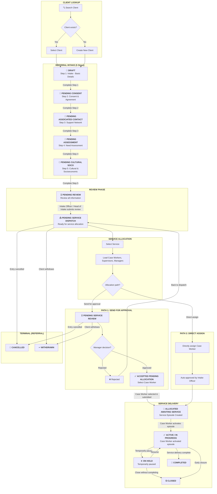
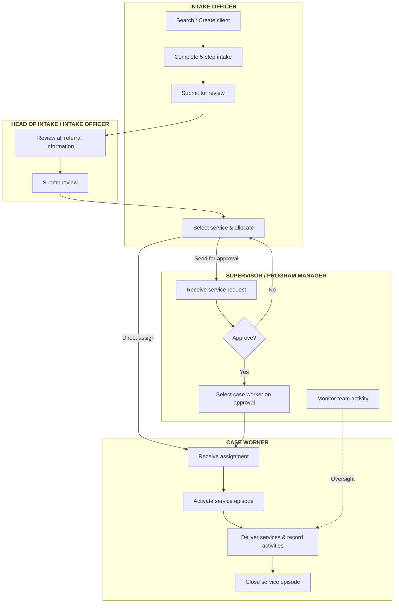
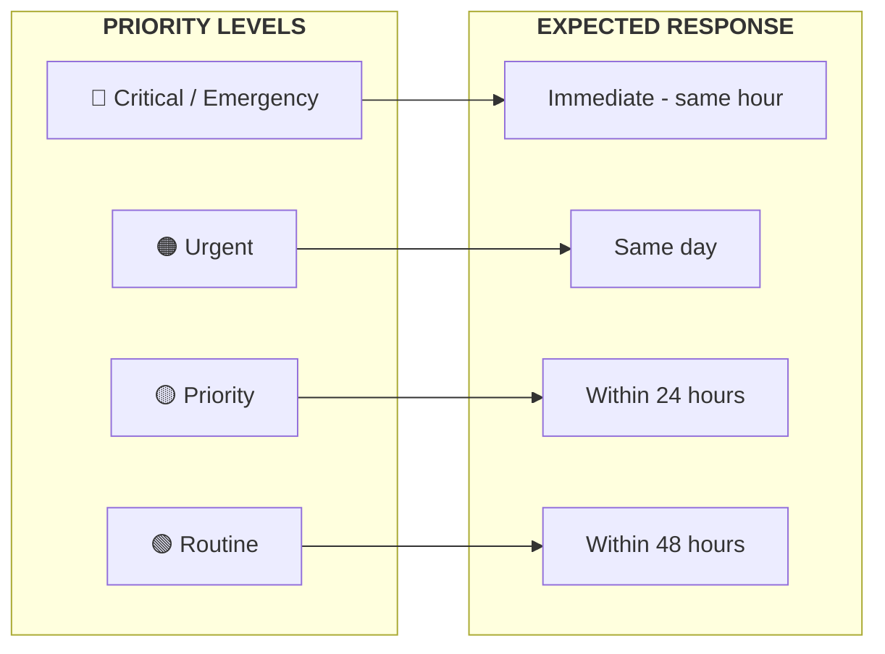
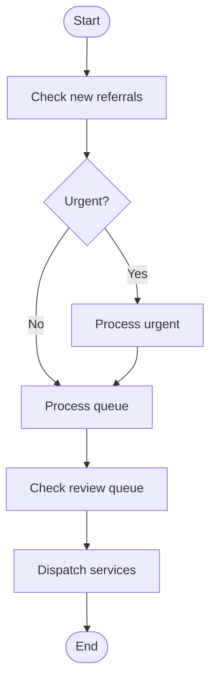
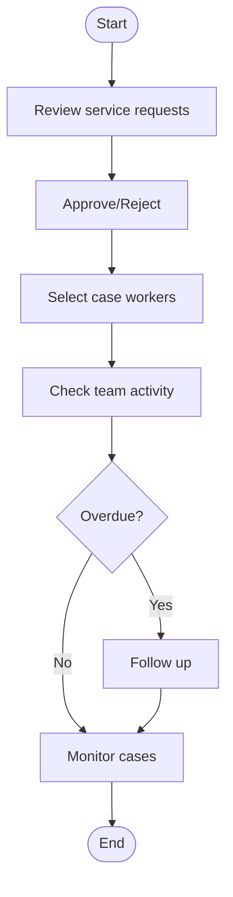
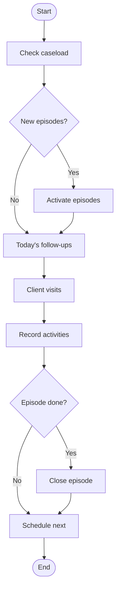

import Callout from '@site/src/components/Callout';

# Workflow Overview

This page provides visual diagrams to help you understand how <Term path="referral" plural /> and <Term path="serviceEpisode" plural /> flow through Manaaki Central. These diagrams are useful for new staff orientation and understanding the end-to-end process.

---

## <Term path="referral" /> Lifecycle

The complete journey of a <Term path="referral" /> from client search to service completion, showing the referral and service episode statuses.

```mermaid
flowchart TB
    subgraph client["<b>CLIENT LOOKUP</b>"]
        search["🔍 Search Client"]
        exists{"Client exists?"}
        select["Select Client"]
        create["Create New Client"]
    end

    subgraph intake_steps["<b>REFERRAL INTAKE (5 Steps)</b>"]
        draft["📝 <b>DRAFT</b><br/>Step 1: Intake - Basic Details"]
        pending_consent["📝 <b>PENDING CONSENT</b><br/>Step 2: Consent & Agreement"]
        pending_contact["📝 <b>PENDING ASSOCIATED CONTACT</b><br/>Step 3: Support Network"]
        pending_assessment["📝 <b>PENDING ASSESSMENT</b><br/>Step 4: Need Assessment"]
        pending_cultural["📝 <b>PENDING CULTURAL SOCO</b><br/>Step 5: Cultural & Socioeconomic"]
    end

    subgraph review["<b>REVIEW PHASE</b>"]
        pending_review["⏳ <b>PENDING REVIEW</b><br/>Review all information"]
        pending_dispatch["📤 <b>PENDING SERVICE DISPATCH</b><br/>Ready for service allocation"]
    end

    subgraph service_allocation["<b>SERVICE ALLOCATION</b>"]
        select_service["Select Service"]
        load_staff["Load Case Workers, Supervisors, Managers"]
        path{"Allocation path?"}
    end

    subgraph approval_path["<b>PATH 1: SEND FOR APPROVAL</b>"]
        pending_service_review["⏳ <b>PENDING SERVICE REVIEW</b>"]
        manager_decision{"Manager decision?"}
        rejected["❌ Rejected"]
        accepted_pending["✅ <b>ACCEPTED PENDING ALLOCATION</b><br/>Select Case Worker"]
    end

    subgraph direct_path["<b>PATH 2: DIRECT ASSIGN</b>"]
        direct_assign["Directly assign Case Worker"]
        auto_approved["Auto-approved by Intake Officer"]
    end

    subgraph delivery["<b>SERVICE DELIVERY</b>"]
        allocated["🎯 <b>ALLOCATED AWAITING SERVICE</b><br/>Service Episode Created"]
        active["✅ <b>ACTIVE / IN PROGRESS</b><br/>Case Worker activated episode"]
        on_hold["⏸️ <b>ON HOLD</b><br/>Temporarily paused"]
        completed["🎉 <b>COMPLETED</b>"]
        closed["🔒 <b>CLOSED</b>"]
    end

    subgraph terminal["<b>TERMINAL (REFERRAL)</b>"]
        cancelled["🚫 <b>CANCELLED</b>"]
        withdrawn["↩️ <b>WITHDRAWN</b>"]
    end

    search --> exists
    exists -->|"Yes"| select
    exists -->|"No"| create
    select --> draft
    create --> draft

    draft -->|"Complete Step 1"| pending_consent
    pending_consent -->|"Complete Step 2"| pending_contact
    pending_contact -->|"Complete Step 3"| pending_assessment
    pending_assessment -->|"Complete Step 4"| pending_cultural
    pending_cultural -->|"Complete Step 5"| pending_review

    pending_review -->|"Intake Officer / Head of Intake submits review"| pending_dispatch

    pending_dispatch --> select_service
    select_service --> load_staff
    load_staff --> path

    path -->|"Send for approval"| pending_service_review
    path -->|"Direct assign"| direct_assign

    pending_service_review --> manager_decision
    manager_decision -->|"Rejected"| rejected
    manager_decision -->|"Approved"| accepted_pending
    rejected -->|"Back to dispatch"| pending_dispatch
    accepted_pending -->|"Case Worker selected & submitted"| allocated

    direct_assign --> auto_approved
    auto_approved --> allocated

    allocated -->|"Case Worker activates episode"| active
    active -->|"Service delivery complete"| completed
    active -->|"Temporarily pause"| on_hold
    on_hold -->|"Resume"| active
    on_hold -->|"Close without completing"| closed
    active -->|"Early closure"| closed
    pending_dispatch -->|"Entry cancelled"| cancelled
    pending_dispatch -->|"Client withdraws"| withdrawn
    pending_service_review -->|"Entry cancelled"| cancelled
    pending_service_review -->|"Client withdraws"| withdrawn

```

### <Term path="referral" /> Intake Steps

The five intake steps represent the progressive completion of a referral form. Each step moves the entry closer to being ready for review:

| Step | Label | What is captured |
|------|-------|-----------------|
| 1 | Draft | Basic intake details — the entry point |
| 2 | Pending Consent | Consent and agreement from the client |
| 3 | Pending Associated Contact | Support network and emergency contacts |
| 4 | Pending Assessment | Needs assessment |
| 5 | Pending Cultural Soco | Cultural and socioeconomic context |

Once all five steps are complete, the entry moves to **Pending Review**.

---

## Role Responsibilities

This diagram shows how work flows between the roles in ManaakiCare.

```mermaid
flowchart TB
    subgraph io["<b>INTAKE OFFICER</b>"]
        io1["Search / Create client"]
        io2["Complete 5-step intake"]
        io3["Submit for review"]
        io4["Select service & allocate"]
    end

    subgraph reviewer["<b>HEAD OF INTAKE / INTAKE OFFICER</b>"]
        rev1["Review all referral information"]
        rev2["Submit review"]
    end

    subgraph sup["<b>SUPERVISOR / PROGRAM MANAGER</b>"]
        sup1["Receive service request"]
        sup2{"Approve?"}
        sup3["Select case worker on approval"]
        sup4["Monitor team activity"]
    end

    subgraph cw["<b>CASE WORKER</b>"]
        cw1["Receive assignment"]
        cw2["Activate service episode"]
        cw3["Deliver services & record activities"]
        cw4["Close service episode"]
    end

    io1 --> io2 --> io3
    io3 --> rev1
    rev1 --> rev2
    rev2 --> io4

    io4 -->|"Send for approval"| sup1
    io4 -->|"Direct assign"| cw1

    sup1 --> sup2
    sup2 -->|"Yes"| sup3
    sup3 --> cw1
    sup2 -->|"No"| io4

    cw1 --> cw2 --> cw3 --> cw4
    sup4 -.->|"Oversight"| cw3

```

### Role Quick Reference

| Role | Primary Responsibilities | Dashboard Focus |
|------|-------------------------|-----------------|
| **Intake Officer** | Search/create clients, complete 5-step intake, dispatch to services, can directly assign <Term path="caseWorker" plural /> | New <Term path="referral" plural />, review queue, service dispatch |
| **Head of Intake / Intake Officer** | Review all <Term path="referral" /> information and submit review | Review queue, pending reviews |
| **Supervisor / Program Manager** | Approve/reject service requests, select <Term path="caseWorker" plural /> on approval, monitor team | Pending service reviews, team <Term path="activity" /> |
| **<Term path="caseWorker" />** | Activate service episodes, deliver services, record activities, close episodes | Active <Term path="cases" />, follow-ups due, client interactions |

---

## Priority Handling

Different priorities have different expected response times.

```mermaid
flowchart LR
    subgraph priorities["<b>PRIORITY LEVELS</b>"]
        direction TB
        critical["🔴 Critical / Emergency"]
        urgent["🟠 Urgent"]
        priority["🟡 Priority"]
        routine["🟢 Routine"]
    end

    subgraph response["<b>EXPECTED RESPONSE</b>"]
        direction TB
        r1["Immediate - same hour"]
        r2["Same day"]
        r3["Within 24 hours"]
        r4["Within 48 hours"]
    end

    critical --> r1
    urgent --> r2
    priority --> r3
    routine --> r4

```

### Priority Guidelines

| Priority | When to Use | Example Scenarios |
|----------|-------------|-------------------|
| **Critical / Emergency** | Immediate safety concern | Child at risk, medical emergency, crisis situation |
| **Urgent** | Needs same-day attention | Family in distress, time-sensitive support needed |
| **Priority** | Important but not emergency | New client intake, scheduled assessment overdue |
| **Routine** | Standard processing | Regular check-in, administrative <Term path="referral" /> |

---

## Daily Workflow by Role

### Intake Officer

```mermaid
flowchart TB
    start(["Start"])
    check["Check new referrals"]
    urgent{"Urgent?"}
    process_urgent["Process urgent"]
    process_queue["Process queue"]
    review["Check review queue"]
    dispatch["Dispatch services"]
    end_day(["End"])

    start --> check
    check --> urgent
    urgent -->|"Yes"| process_urgent
    urgent -->|"No"| process_queue
    process_urgent --> process_queue
    process_queue --> review
    review --> dispatch
    dispatch --> end_day
```

### Supervisor

```mermaid
flowchart TB
    start(["Start"])
    pending["Review service requests"]
    accept_reject["Approve/Reject"]
    allocate["Select case workers"]
    contacts["Check team activity"]
    followup{"Overdue?"}
    chase["Follow up"]
    monitor["Monitor cases"]
    end_day(["End"])

    start --> pending
    pending --> accept_reject
    accept_reject --> allocate
    allocate --> contacts
    contacts --> followup
    followup -->|"Yes"| chase
    followup -->|"No"| monitor
    chase --> monitor
    monitor --> end_day
```

### <Term path="caseWorker" />

```mermaid
flowchart TB
    start(["Start"])
    dashboard["Check caseload"]
    activate{"New episodes?"}
    activate_ep["Activate episodes"]
    today["Today's follow-ups"]
    visits["Client visits"]
    record["Record activities"]
    close{"Episode done?"}
    close_ep["Close episode"]
    schedule["Schedule next"]
    end_day(["End"])

    start --> dashboard
    dashboard --> activate
    activate -->|"Yes"| activate_ep
    activate -->|"No"| today
    activate_ep --> today
    today --> visits
    visits --> record
    record --> close
    close -->|"Yes"| close_ep
    close -->|"No"| schedule
    close_ep --> schedule
    schedule --> end_day
```

---

## Status Reference

All status values used across the system, grouped by lifecycle. These are the values you will see in badges, filters, and reports.

### Referral statuses

These statuses track where an entry is in the intake-to-allocation pipeline.

| Status | Description |
|--------|-------------|
| **Draft** | Entry is being created — intake step 1 in progress |
| **Pending Consent** | Intake step 2 — awaiting consent and agreement |
| **Pending Review** | All intake steps complete, awaiting review submission |
| **Pending Service Dispatch** | Review complete, ready for service selection and allocation |
| **Pending Service Review** | Service request sent to supervisor/programme manager for approval |
| **Accepted Pending Allocation** | Service approved by manager, <Term path="caseWorker" /> selection pending |
| **Allocated Awaiting Service** | <Term path="caseWorker" /> assigned, service episode created and ready to commence |
| **Cancelled** | Entry cancelled before a service episode began |
| **Withdrawn** | Client withdrew before a service episode began |

### Service episode statuses

Once a referral is allocated, a service episode is created and moves through its own lifecycle.

| Status | Description |
|--------|-------------|
| **Awaiting Staff Assignment** | Service episode created, no <Term path="caseWorker" /> yet confirmed |
| **Awaiting Commencement** | <Term path="caseWorker" /> assigned, waiting for them to activate the episode |
| **Active / In Progress** | <Term path="caseWorker" /> has activated the episode — service delivery is underway |
| **On Hold** | Delivery temporarily paused (e.g. client unavailable, waiting on external factor) |
| **Completed** | Service episode successfully concluded |
| **Closed** | Episode closed without full completion (early closure or termination) |

### Consent statuses

Consent is tracked separately from the referral status and may change at any point.

| Status | Description |
|--------|-------------|
| **Consent Active** | Client has given consent and it remains in force |
| **Consent Withdrawn** | Client has withdrawn their consent — service delivery should not proceed |

:::warning
If a client's consent is withdrawn at any stage, check with your supervisor before taking any further action on their record.
:::

---

## Related Documentation

- [Intake Officer Dashboard](/dashboards/intake-officer) - Processing <Term path="referral" plural />
- [Supervisor Dashboard](/dashboards/supervisor) - Managing team and approvals
- [Case Worker Dashboard](/dashboards/case-worker) - Managing <Term path="caseload" />
- [Referral Overview](/referrals/overview) - Detailed <Term path="referral" /> documentation
- [User Roles](/user-roles/case-worker) - Role permissions and responsibilities
