import Callout from '@site/src/components/Callout';

# Workflow Overview

This page provides visual diagrams to help you understand how referrals and service episodes flow through Manaaki Central. These diagrams are useful for new staff orientation and understanding the end-to-end process.

---

## Referral Lifecycle

The complete journey of a referral from creation to service completion.

```mermaid
flowchart TB
    subgraph intake["<b>INTAKE PHASE</b>"]
        draft["📝 Draft"]
        submitted["📤 Submitted"]
        pending_review["⏳ Pending Review"]
    end

    subgraph approval["<b>APPROVAL PHASE</b>"]
        pending_service["📋 Pending Service Review"]
        rejected["❌ Rejected"]
    end

    subgraph delivery["<b>SERVICE DELIVERY PHASE</b>"]
        awaiting["🕐 Awaiting Service"]
        active["✅ Active"]
        completed["🎉 Completed"]
    end

    draft -->|"Intake Officer submits"| submitted
    submitted -->|"Auto-progress"| pending_review
    pending_review -->|"Supervisor approves"| pending_service
    pending_review -->|"Supervisor rejects"| rejected
    rejected -->|"Resubmit with changes"| pending_review
    pending_service -->|"Dispatch to service"| awaiting
    awaiting -->|"Case Worker begins"| active
    active -->|"Service complete"| completed

```

### Status Definitions

| Status | Phase | Owner | Description |
|--------|-------|-------|-------------|
| **Draft** | Intake | Intake Officer | Referral started but not yet submitted |
| **Submitted** | Intake | Intake Officer | Sent for initial processing |
| **Pending Review** | Intake | Supervisor | Awaiting supervisor approval |
| **Rejected** | Approval | Supervisor | Returned with feedback for correction |
| **Pending Service Review** | Approval | Intake Officer | Approved, ready for service allocation |
| **Awaiting Service** | Delivery | Case Worker | Dispatched, waiting for service to begin |
| **Active** | Delivery | Case Worker | Service delivery in progress |
| **Completed** | Delivery | Case Worker | Service delivery finished |

---

## Role Responsibilities

This diagram shows how work flows between the three main roles in ManaakiCare.

### Role Quick Reference

| Role | Primary Responsibilities | Dashboard Focus |
|------|-------------------------|-----------------|
| **Intake Officer** | Create referrals, process intake, dispatch to services | New referrals, review queue, service dispatch |
| **Supervisor** | Approve/reject referrals, allocate to team, monitor contacts | Pending requests, team activity, client engagement |
| **Case Worker** | Deliver services, record activities, manage follow-ups | Active cases, follow-ups due, client interactions |

---

## Service Request Flow

When a referral is dispatched to a service, the supervisor must accept or reject it.

<Callout color="teal" title="Automatic Episode Creation">
When a supervisor accepts a service request, Manaaki Central automatically creates a service episode. If a case worker is selected during acceptance, they are immediately assigned and can see the episode on their dashboard.
</Callout>

---

## Priority Handling

Different priorities have different expected response times.

```mermaid
flowchart LR
    subgraph priorities["<b>PRIORITY LEVELS</b>"]
        direction TB
        critical["🔴 Critical / Emergency"]
        urgent["🟠 Urgent"]
        priority["🟡 Priority"]
        routine["🟢 Routine"]
    end

    subgraph response["<b>EXPECTED RESPONSE</b>"]
        direction TB
        r1["Immediate - same hour"]
        r2["Same day"]
        r3["Within 24 hours"]
        r4["Within 48 hours"]
    end

    critical --> r1
    urgent --> r2
    priority --> r3
    routine --> r4

```

### Priority Guidelines

| Priority | When to Use | Example Scenarios |
|----------|-------------|-------------------|
| **Critical / Emergency** | Immediate safety concern | Child at risk, medical emergency, crisis situation |
| **Urgent** | Needs same-day attention | Family in distress, time-sensitive support needed |
| **Priority** | Important but not emergency | New client intake, scheduled assessment overdue |
| **Routine** | Standard processing | Regular check-in, administrative referral |

---

## Daily Workflow by Role

### Intake Officer

```mermaid
flowchart TB
    start(["☀️ Start"])
    check["Check new referrals"]
    urgent{"Urgent?"}
    process_urgent["Process urgent"]
    process_queue["Process queue"]
    review["Check In Review"]
    dispatch["Dispatch approved"]
    end_day(["🌙 End"])

    start --> check
    check --> urgent
    urgent -->|"Yes"| process_urgent
    urgent -->|"No"| process_queue
    process_urgent --> process_queue
    process_queue --> review
    review --> dispatch
    dispatch --> end_day
```

### Supervisor

```mermaid
flowchart TB
    start(["☀️ Start"])
    pending["Review pending"]
    accept_reject["Accept/Reject"]
    allocate["Allocate to team"]
    contacts["Check contacts due"]
    followup{"Overdue?"}
    chase["Follow up"]
    monitor["Monitor activity"]
    end_day(["🌙 End"])

    start --> pending
    pending --> accept_reject
    accept_reject --> allocate
    allocate --> contacts
    contacts --> followup
    followup -->|"Yes"| chase
    followup -->|"No"| monitor
    chase --> monitor
    monitor --> end_day
```

### Case Worker

```mermaid
flowchart TB
    start(["☀️ Start"])
    dashboard["Check caseload"]
    overdue{"Overdue?"}
    address["Address overdue"]
    today["Today's follow-ups"]
    visits["Client visits"]
    record["Record activities"]
    schedule["Schedule next"]
    end_day(["🌙 End"])

    start --> dashboard
    dashboard --> overdue
    overdue -->|"Yes"| address
    overdue -->|"No"| today
    address --> today
    today --> visits
    visits --> record
    record --> schedule
    schedule --> end_day
```

---

## Data Visibility

Understanding who can see what in Manaaki Central.

| Role | Can View | Cannot View |
|------|----------|-------------|
| **Case Worker** | Own assigned service episodes and activities | Other case workers' cases |
| **Supervisor** | Own records + all supervised case workers' records | Records outside their team |
| **Program Manager / Admin** | All records within their organisation | Records from other organisations |

---

## Related Documentation

- [Intake Officer Dashboard](/dashboards/intake-officer) - Processing referrals
- [Supervisor Dashboard](/dashboards/supervisor) - Managing team and approvals
- [Case Worker Dashboard](/dashboards/case-worker) - Managing caseload
- [Referral Overview](/referrals/overview) - Detailed referral documentation
- [User Roles](/user-roles/case-worker) - Role permissions and responsibilities
