import Callout from '@site/src/components/Callout';

# Workflow Overview

This page provides visual diagrams to help you understand how <Term path="referral" plural /> and <Term path="serviceEpisode" plural /> flow through Manaaki Central. These diagrams are useful for new staff orientation and understanding the end-to-end process.

---

## <Term path="referral" /> Lifecycle

The complete journey of a <Term path="referral" /> from client search to service completion, showing all 13 <Term path="referral" /> statuses.

### All <Term path="referral" /> Statuses

| # | Status | Phase | Description |
|---|--------|-------|-------------|
| 1 | **Draft** | Intake | Step 1 - Intake officer filling in basic details |
| 2 | **Pending Consent** | Intake | Step 2 - Waiting for consent & agreement to be completed |
| 3 | **Pending Associated Contact** | Intake | Step 3 - Waiting for support network / emergency contacts |
| 4 | **Pending Assessment** | Intake | Step 4 - Waiting for need assessment to be completed |
| 5 | **Pending Cultural Soco** | Intake | Step 5 - Waiting for cultural & socioeconomic details |
| 6 | **Pending Review** | Review | All 5 steps complete, awaiting intake officer / head of intake review |
| 7 | **Pending Service Dispatch** | Dispatch | Review submitted, ready for service allocation |
| 8 | **Pending Service Review** | Approval | Service request sent to supervisor / program manager for approval |
| 9 | **Accepted Pending Allocation** | Approval | Service approved by manager, <Term path="caseWorker" /> selection pending |
| 10 | **Allocated Awaiting Service** | Delivery | <Term path="caseWorker" /> assigned, service episode created (Awaiting Commencement) |
| 11 | **Service In Progress** | Delivery | <Term path="caseWorker" /> has activated the service episode |
| 12 | **Completed** | Closed | Service episode successfully completed |
| 13 | **Closed** | Closed | <Term path="referral" /> closed (early closure or termination) |

---

## Role Responsibilities

This diagram shows how work flows between the roles in ManaakiCare.

### Role Quick Reference

| Role | Primary Responsibilities | Dashboard Focus |
|------|-------------------------|-----------------|
| **Intake Officer** | Search/create clients, complete 5-step intake, dispatch to services, can directly assign <Term path="caseWorker" plural /> | New <Term path="referral" plural />, review queue, service dispatch |
| **Head of Intake / Intake Officer** | Review all <Term path="referral" /> information and submit review | Review queue, pending reviews |
| **Supervisor / Program Manager** | Approve/reject service requests, select <Term path="caseWorker" plural /> on approval, monitor team | Pending service reviews, team <Term path="activity" /> |
| **<Term path="caseWorker" />** | Activate service episodes, deliver services, record activities, close episodes | Active <Term path="cases" />, follow-ups due, client interactions |

---

## Priority Handling

Different priorities have different expected response times.

```mermaid
flowchart LR
    subgraph priorities["<b>PRIORITY LEVELS</b>"]
        direction TB
        critical["🔴 Critical / Emergency"]
        urgent["🟠 Urgent"]
        priority["🟡 Priority"]
        routine["🟢 Routine"]
    end

    subgraph response["<b>EXPECTED RESPONSE</b>"]
        direction TB
        r1["Immediate - same hour"]
        r2["Same day"]
        r3["Within 24 hours"]
        r4["Within 48 hours"]
    end

    critical --> r1
    urgent --> r2
    priority --> r3
    routine --> r4

```

### Priority Guidelines

| Priority | When to Use | Example Scenarios |
|----------|-------------|-------------------|
| **Critical / Emergency** | Immediate safety concern | Child at risk, medical emergency, crisis situation |
| **Urgent** | Needs same-day attention | Family in distress, time-sensitive support needed |
| **Priority** | Important but not emergency | New client intake, scheduled assessment overdue |
| **Routine** | Standard processing | Regular check-in, administrative <Term path="referral" /> |

---

## Daily Workflow by Role

### Intake Officer

### Supervisor

### <Term path="caseWorker" />

---

## Related Documentation

- [Intake Officer Dashboard](/dashboards/intake-officer) - Processing <Term path="referral" plural />
- [Supervisor Dashboard](/dashboards/supervisor) - Managing team and approvals
- [Case Worker Dashboard](/dashboards/case-worker) - Managing <Term path="caseload" />
- [Referral Overview](/referrals/overview) - Detailed <Term path="referral" /> documentation
- [User Roles](/user-roles/case-worker) - Role permissions and responsibilities
